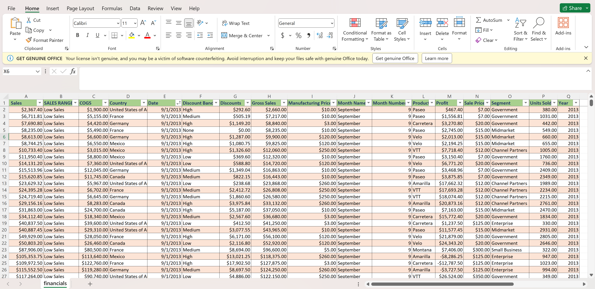
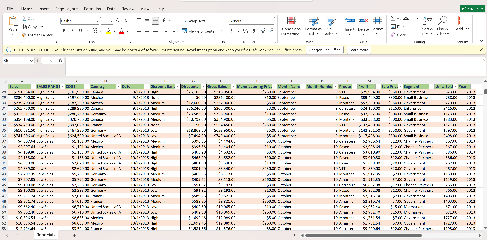
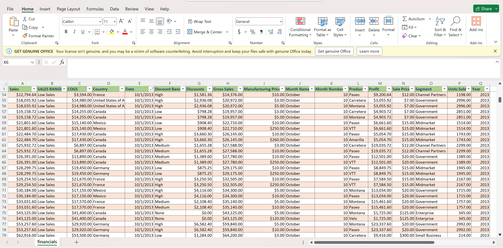
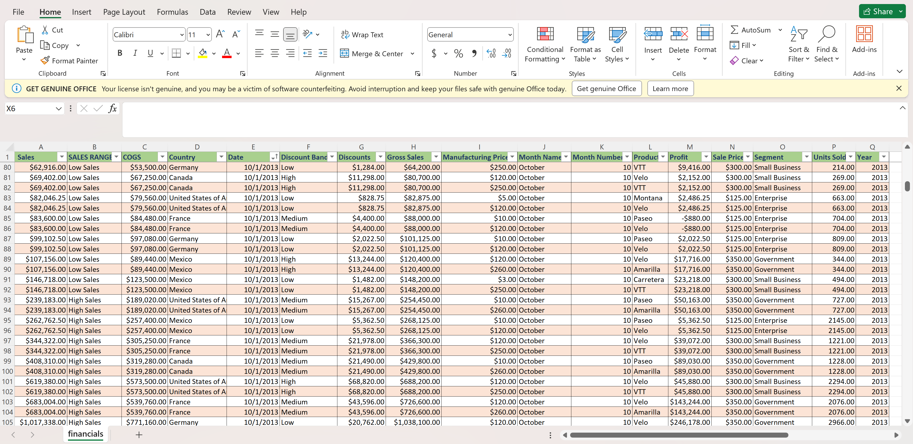
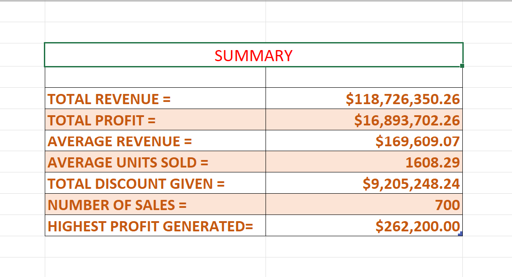
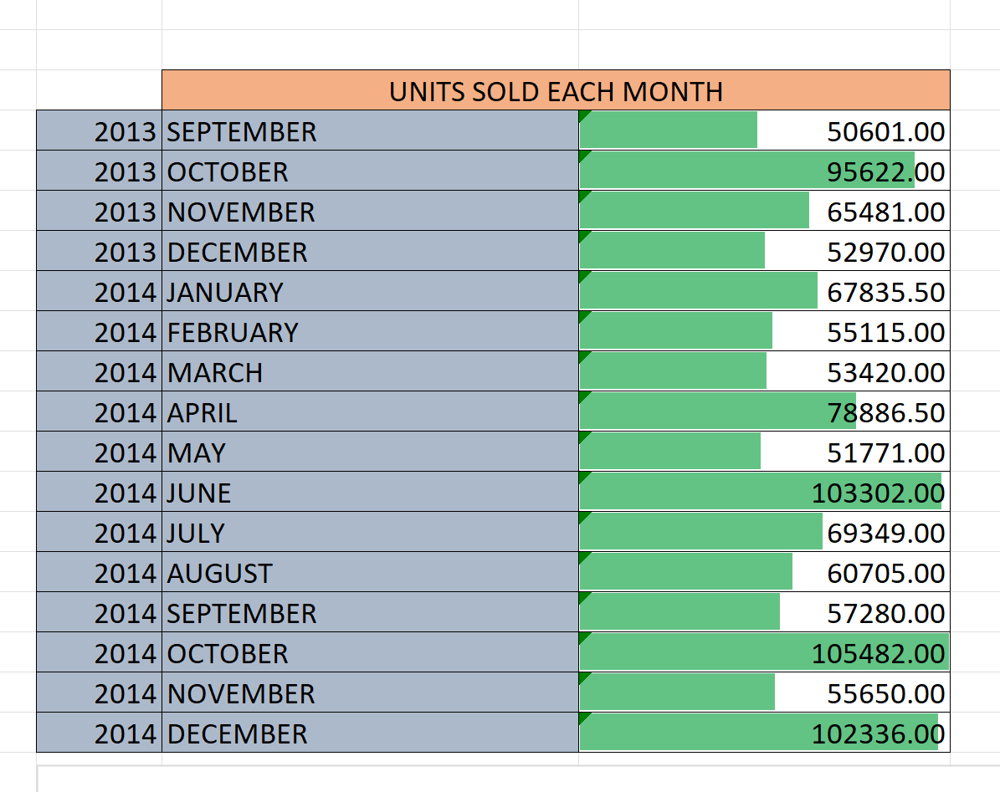
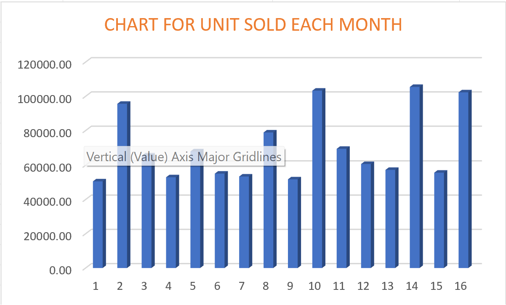

# Imaginary Company

## Introduction
### The dummy data on this data set was created using Microsoft Excel to find out the frequency of number of goods sold in each month from September 2013 to December 2014 and to make informed decision on when to slow down production in coming months so as not to run into excess production leading to diminishing returns.

screen 1         | screen 2
:-------------:|:--------------------:
 | 
screen 3         | screen 4
 | 

## Features used in excel
Formulas, Conditional statements and Charts to show distribution.

## Problem Statement
1. To determine total revenue, total profit, 
2. Average revenue, average units sold, 
3. Total discount given, number of sales and
4. Highest profit generated.
5. To determine the month with the highest units of goods sold
6. To determine the month with the lowest units of goods sold

---
---
#ANALYSIS

The above data shows that in the month of October 2014 105,482 number of goods where sold making it the highest number of goods sold within the recorded period and in the month of September 2013 50,601 number of goods were sold making it the lowest number of goods sold within the recorded period.
---
---
---

